# bitrix.exam2
Готовый экзамен №2 (образ VMware, бэкап Битрикс, папка local)

Некоторые задания, которые не вошли в публичные материалы для подготовки:

### [ех2-43] Изменить «слоган» в шаблоне сайта

#### Общие требования

•	Задачу решить через свойство страницы и расширение возможностей типового компонента catalog.element. Компонент расположен по адресу /products/ в составе комплексного и отображает детальную страницу элемента. Комплексный компонент отображает данные из инфоблока Продукция.

•	Создание нового компонента или подмена стандартного через local будет неверным решением, компонент должен остаться типовой. Нужно воспользоваться расширением его возможностей с помощью специальных файлов шаблона.

•	Алгоритм решения, при котором будет использоваться некэшируемое обращение к базе данных - не будет верным.

#### Решаемая задача

•	Добавить свойство страницы сайта «Слоган в шапке сайта», с кодом «slogan_head»

•	Управление значением свойства должно быть доступно администратору сайта.

•	Текст слогана в шаблоне сайта, в файле header.php, устанавливается редактируемой областью. Редактируемую область заменить на вывод слогана с помощью созданного свойства страницы «Слоган в шапке сайта».

•	По умолчанию для всего сайта установить значение свойства: «Слоган компании находится в этом месте».

•	На детальной странице товара в каталоге (/products/N/M/ устанавливать слоган в шаблоне сайта равным первым 40 символам из описания товара для анонса.

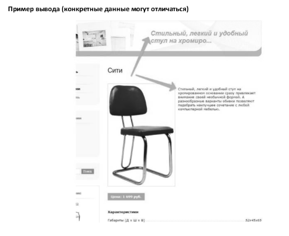

### [ех2-75] Проверка текста при изменении новости

•	Реализовать проверку при изменении элемента информационного блока, в существующем информационном блоке Новости.

•	Если текст анонса содержит слово «калейдоскоп» то при изменении новости - заменять слово «калейдоскоп» на «[...]»

•	При замене слова - добавлять запись в журнал событий: «Замена слова калейдоскоп на [...], в новости с ID = {ID}». Где (ID) - это идентификатор новости, в которой было обработано изменение текста.

### [ех2-77] Разработать простой компонент «Каталог товаров»

#### Общие требования

•	У созданного компонента задать код: simplecomp.exam, название: «Мой компонент», раздел для отображения компонента в визуальном редакторе: «Экзамен №2».

•	Работу решения продемонстрировать в разделе сайта /ex2/simplecomp/ добавить пункт в главное меню «Экзамен2», и пункт в левом меню «Простой компонент».

#### Решаемая задача
•	Компонент должен выводить список товаров, сгруппированных по альтернативному классификатору. Альтернативный классификатор - разделы другого информационного блока.

•	Множественная привязка не будет использоваться.

•	Используется только один уровень разделов, вложенности - не будет.

•	Большой объем разделов и элементов не предполагается (не более 20 разделов и 100 элементов), лимиты на выборку и постраничная навигация - не нужны.

#### Технические требования

•	Использовать при решении метод GetMixedList - нельзя.

•	Компонент должен иметь только такие параметры:

    o	ID инфоблока с каталогом товаров, строка.

    o	ID инфоблока с альтернативным классификатором, строка.

    o	Код свойства, в котором хранится привязка к классификатору, строка.

    o	Типовые настройки кеширования: авто+упровляемое, кешировать, не кешировать, и время кеширования.

    o	Выбор шаблона.

•	Условия кеширования результата работы компонента - по умолчанию, не зависит от дополнительных данных.

#### Инфоблоки, получаемые данные

•	Использовать существующий инфоблок Продукция.

•	Создать инфоблок Альтернативный классификатор. В нем создать 2 раздела, назвать: Раздел 1, Раздел 2.

•	У разделов в инфоблоке Продукция создать пользовательское свойство Альтернативный классификатор, код UF_NEW_CLASSIFIER, тип - привязка к разделом.

•	Разделы инфоблока Продукция привязать к разделам альтернативного классификатора:

    o	«Детская мебель» и «Мебель для кухни» к «Раздел 1» 

    o	«Мягкая мебель» и «Офисная мебель» к «Раздел 2»

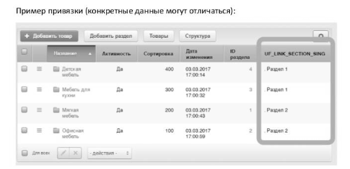

(для возможности отображения пользовательских полей в списке - настройте инфоблок на раздельный просмотр разделов и элементов)

•	Используемые в шаблоне данные разделов альтернативного классификатора:

    o	Поля: название
    
•	Используемые в шаблоне данные разделов каталога товаров:

    o	Поля: название.
    
•	Используемые в шаблоне данные элементов каталога:

    o	Поля: название.
    o	Свойства: цена, материал, артикул.
    
•	Сортировка при отборе не задается.

#### Установка заголовка страницы
•	В компоненте устанавливать заголовок страницы: «В каталоге товаров представлено разделов: [Количество]» где Количество - количество отображаемых разделов альтернативного классификатора.

•	Заголовок должен устанавливаться в файле componentphp. Этот функционал является логикой компонента и не должен «теряться» при смене шаблона.

#### Отображение данных

•	Строится дерево разделов альтернативного классификатора и элементов, относящихся к нему.

•	Рядом с названием альтернативного классификатора отображаются название связанных разделов каталога.

•	Рядом с товаром отображаются: цена, материал, артикул.

### [ех2-112] Ссылка на детальный просмотр товара.

#### Решаемая задача

•	Внести доработки в созданный ранее простой компонент.

•	Построить ссылки на детальный просмотр элементов из каталога товаров, отобразить ссылку в шаблоне компонента.

•	Детальный просмотр не нужно реализовывать, товар уже выводится в разделе /products/.../.../,, переход по полученный ссылке должен быть корректный, на товар в этом разделе.

•	Ссылка должна строиться не по шаблону созданному «в ручную», а на основании данных полученных элементов.

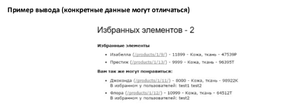

### [ех2-73] Создание комплексного компонента «Моя фотогалерея» 

#### Общие требования

•	Расширить возможности стандартного комплексного компонента Фотогалерея (photo), добавить в него новую страницу exampage.php и переменные.

•	Для новой страницы exampage.php реализовать поддержку как ЧПУ так и не ЧПУ режима.

•	Для решения предоставляются материалы - заготовка компонента, complexcomp.exam- materials. Это компонент photo, с добавленными заглушками в параметрах, созданной страницей exampage.php. Необходимо реализовать логику в файле components и вывод в шаблоне по заданию.

•	Работу решения продемонстрировать в разделе сайта /ex2/complexcomponent/, добавить пункт в главное меню «Экзомен2», и пункт в левом меню «Комплексный компонент».

#### Доработка компонента

•	Добавить переменные для построения адреса страницы: PARAM1, PARAM2.

•	Шаблон адреса по умолчанию для страницы exompoge.php при ЧПУ режиме: «123/456/edit/?PARAM2=789», где 123 это значение переменой SECTION_ID, 456 - ELEMENT_ID, edit - PARAM1, 789 - PARAM2

•	Условие, по которому открывается страница exampage.php без ЧПУ режима: заданы значения переменных SECTION_ID, ELEMENT_ID, PARAM1

•	В настройках компонента реализовать

    o	Для ЧПУ режима: управление шаблоном адреса страницы exampage.php 
    o	Для не ЧПУ режима: управление именами переменных.

#### Отображение данных

•	Компонент настроить на отображение инфоблока Продукция.

•	На странице компонента detail.php, перед подключением bitrix:photo.detail вывести ссылку на страницу exampage.php.

•	Для проверки решения в ссылку подставить значениями переменных. SECTION_ID, ELEMENT_ID- значения определенные комплексным компонентом, PARAM1 = edit, PARAM2 = 789.

•	Значения можно подставить с помощью str_replace.

•	На странице exampage.php вывести значение переменных SECTION_ID, ELEMENT_ID, PARAM1, PARАМ2

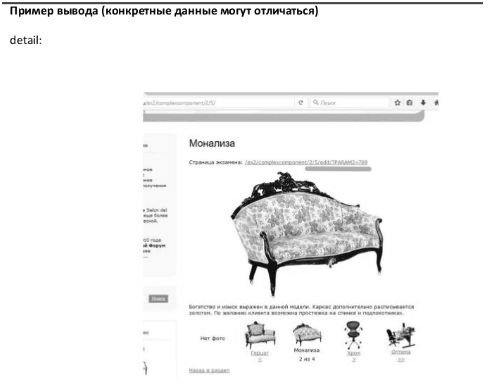

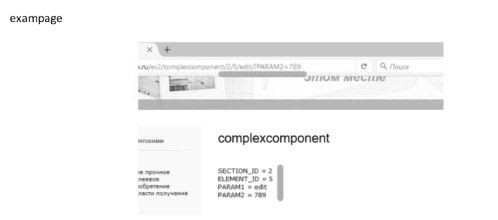

### [ex2-109] Изменить фон в шапке

#### Общие требования

•	Задачу решить через свойство страницы и расширение возможностей типового компонента catalog.element. Компонент расположен по адресу /products/ в составе комплексного и отображает детальную страницу элемента. Комплексный компонент отображает данные из инфоблока Продукция.

•	Создание нового компонента или подмена стандартного через local будет неверным решением, компонент должен остаться типовой. Нужно воспользоваться расширением его возможностей с помощью специальных файлов шаблона.

•	Алгоритм решения, при котором будет использоваться некэшируемое обращение к базе данных – не будет верным.

#### Решаемая задача

•	Добавить свойство страницы сайта «Стиль для фона» с символьным кодом «head_style».

•	Управление значением свойства должно быть доступно администратору сайта.

•	В файле header.php шаблона сайта в тег < div id="header"> добавит атрибут «style», значение атрибута устанавливать из созданного свойства страницы «Стиль для фона страницы».
    
•	По умолчанию для всего сайта установить пустое значение свойства, для страницы «Контакты» задать значение «background-color: red».

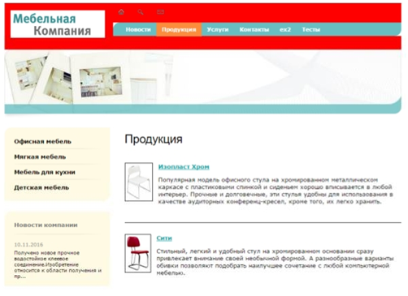

•	На детальной странице товара (products/…/…/) устанавливать свойства страницы равное «background-image: url(#IMAGE#); background-size: contain;», #IMAGE# - это пусть к детальной картинке товара. Если картинка не задана – должен остаться пустой стиль.

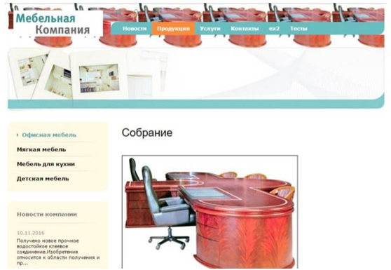

### [ex2-92] Задать особую индексацию для элементов инфоблока «Новости»

•	При индексации элементов информационного блока «Новости» заменять заголовок результата поиска на первые 50 символов текса анонса новости.

•	Результат проверить в разделе сайта /search/, для проверки решения достаточно пересохранить один элемент информационного блока.

•	Результат проверять на поиске новости с текстом «Salon del Mobile»:

    o	Без доработки, результат поиска такой

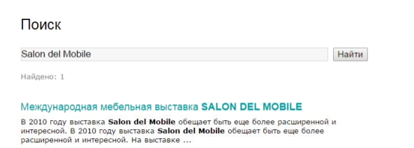

    o	После доработки должен стать такой:

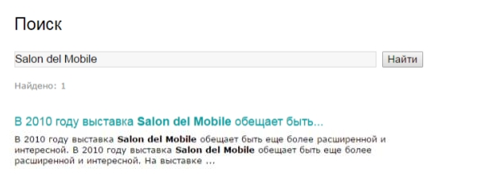

### [ex2-96] Разработать простой компонент «Избранные товары»

#### Общие требования

•	У созданного компонента задать код: simplecomp.exam, название «Простой компонент», раздел для отображения компонента в визуальном редакторе: «Экзамен №2».

•	Для решения предоставляются материалы – заготовка компонента, simplecomp.exam-materials. В заготовке создана необходимая файловая структура, и демо-вызов API по выборке. Эти материалы можно не использовать, предоставляются для ускорения решения задания.

•	Работу решения продемонстрировать в разделе сайта /ex2/simplecomp/, добавить пункт в главное меню «Экзамен №2», и пункт в левом меню «Простой компонент».

#### Используемые данные

•	Для решения задания в информационном блоке Продукция создать множественное свойство: «В избранном у пользователей», тип – привязка к пользователям.

•	Создать двух тестовых пользователей с логинами test1 и test2.

•	Задать привязку товары к пользователям, используя свойство «В избранном у пользователей». Использовать товары из раздела Мягкая мебель:

| Товар         | Пользователи  |
| ------------- | ------------- |
| Изабелла  | admin, test2  |
| Алладин	  | test1  |
| Джоконда  | test1, test2  |
| Флора  | test2  |
| Престиж  | admin  |

#### Решаемая задача

•	Компонент должен выводить два списка товаров:

    o	Первый список – избранные товары текущего пользователя.
    
    o	Второй список – избранные товары других пользователей, у которых есть хотя бы один общий товар в избранном с текущим пользователем.
    
    o	Во втором списке возле каждого товара выводится список логинов пользователей, у которых он находится в избранном.
    
    o	При построении второго списка нужно исключить товары, уже присутствующие в первом списке.
    
•	Большой объем элементов в избранном не предполагается, лимиты на выборку и постраничная навигация – не нужны.

•	Не авторизованному пользователя списки не выводятся.

•	Используемые в шаблоне данные элементов каталога:

    o	Поля: название.
    
    o	Свойства: цена, материал, артикул.
    
•	Сортировка при отборе элементов не задается.

#### Пример вывода (конкретные данные могут отличаться)

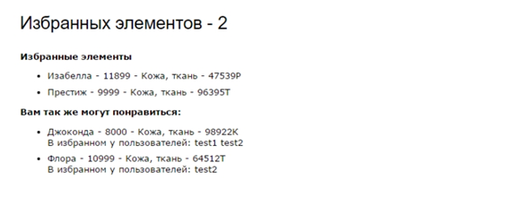

#### Технические требования

•	Использовать при решении метод GetMixedList – нельзя.

•	Компонент должен иметь параметры:

    o	ID инфоблока с каталогом товаров, строка.
    
    o	Код свойства, в котором хранится привязка к пользователям, строка. При реализации компонента использовать значение этого параметра.
    
    o	Типовые настройки кеширования: авто+управляемое, кешировать, не кешировать, и время кеширования.
    
    o	Выбор шаблона.
    
•	Зависимость кеширования – от текущего пользователя, у каждого свой список избранного.

#### Установка заголовка страницы

•	В компоненте устанавливать заголовок страницы: «Избранных элементов – [Количество]».

•	Где Количество – количество элементов каталога из первого списка.

•	Заголовок должен устанавливаться в файле component.php. Этот функционал является логикой компонента и не должен «теряться» при смене шаблона.

### [ex2-101] Добавить пункт «Hello world» в меню компонента.

#### Решаемая задача

•	В созданном ранее компоненте добавить кнопку меню «Hello world».

•	По клику кнопка перенаправляет на текущую страницу с прибавлением get-параметра hello=world (другие get-параметры должны сохраняться)

#### Пример результата (конкретные данные могут отличаться)

### [ex2-103] Добавить англоязычную версию сайта (отдельный инфоблок)

#### Общие требования

•	Создать второй сайт:

o	Используя принцип размещения – на одном доме;

o	Язык – английский.

•	Второй сайт разместить в разделе первого сайта, путь /ex2/site2/, добавить пункт в главное меню «Экзамен2», и пункт в левом меню «Второй сайт».

#### Используемые данные

•	Импортировать информационный блок News из материалов к заданию, /ex2-103/iblock/
Решаемая задача

•	Шаблон второго сайта – из материалов к заданию /ex2-103/ex2_multilang_template_materials/.

•	Структура второго сайта – главная и 2 раздела: about и news.

    o	Структуру отразить в верхнем меню;
    
    o	главная и раздел about – взять из материалов к заданию /ex2-103/site/;
    
    o	создать раздел news.
    
•	В разделе news вывести:

    o	Новости из импортированного инфоблока News, с помощью комплексного компонента;
    
    o	Дату вывести в формате: Месяц/День/Год, формат должен задаваться на уровне всего сайта, а не компонента.
    
•	В шаблонах сайтов добавить переключатель языков (сайтов):

    o	Вывести переключатель в правой колонке сайта, в блоке Choose language с помощью соответствующего компонента.
    
    o	Изменить типовой шаблон компонента, сделать выпадающий список, текст значений в котором – код языка (en, ru).
    
    o	Продублировать вывод блока с переключением сайта в шаблоне первого сайта.
    
    o	При этом шаблон компонента должен быть физически один и для первого и для второго сайта
    
#### Пример реализации:

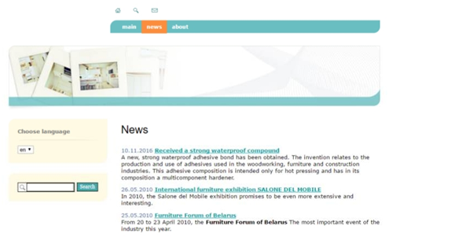

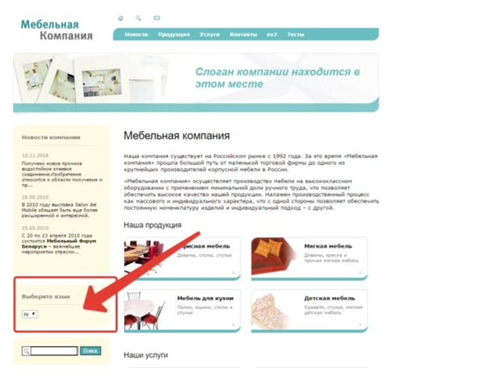

### [ех2-93] Записывать в Журнал событий открытие не существующих страниц сайта

•	Если открываемой страницы нет, сайт вернул 404, то записать это в журнал событий.

•	Необходимо обрабатывать как несуществующие статические страницы, так и динамические

•	Если страница не найдена, то в системе создаётся константа ERROR 404, равная «Y».

•	Параметры записи в журнал

| SEVERITY  | INFO |
| ------------- | ------------- |
| AUDIT_TYPE_ID  | ERROR_404  |
| MODULE_ID  | main  |
| DESCRIPTION  | url страницы |

•	Проверяем, открываем адреса не существующих страниц:	

    o	/not_reai/?not=N 
    
    o	/news/not_real/
    
В журнале /bitrix/admin/event_log.php?lang=ru должны появиться соответствующие записи.

### [ех2-90] Разработать простой компонент «Каталог товаров»

#### Общие требования

•	У созданного компонента задать код: simplecomp.exam, название: «Простой компонент», раздел для отображения компонента в визуальном редакторе: «Экзамен №2».

•	Для решения предоставляются материалы - заготовка компонента, simplecomp.exam-materials. В заготовке создана необходимая файловая структура, и демо-вызов API по выборке элементов. Эти материалы можно не использовать, предоставляются лишь с целью ускорения решения задания.

•	Работу решения продемонстрировать в разделе сайта /ex2/simplecomp/ добавить пункт в главное меню «Экзамен2», и пункт в левом меню «Простой компонент».

#### Решаемая задача

• Компонент должен выводить список товаров, сгруппированных по альтернативному классификатору. Альтернативный классификатор - разделы другого информационного блока.

•	Будет использоваться множественная привязка элементов к альтернативному классификатору.

•	Используется только один уровень разделов, вложенности - не будет.

•	В информационном блоке каталога товаров предполагается большое количество элементов (порядок - тысячи), но при этом товаров, у которых будет задана привязка к альтернативному классификатору - будет не более нескольких десятков.

#### Технические требования

•	Использовать при решении метод GetMixedList- нельзя.

•	Компонент должен иметь параметры:

    o	ID инфоблока с каталогом товаров, строка, о ID инфоблока с классификатором, строка.
    
    o	Код свойства, в котором хранится привязка к классификатору, строка. При реализации компонента использовать значение этого параметра.
    
    o	Типовые настройки кеширования: авто+управляемое, кешировать, не кешировать, и время кеширования.
    
    o	Выбор шаблона.
    
• Зависимость кеширования - по умолчанию, не зависит от дополнительных параметров.

#### Инфоблоки, получаемые данные

•	Для демонстрации решения задания использовать существующие информационные блоки Продукция и Услуги.

•	В информационном блоке Услуги создать 3 раздела, заполнить: Наименование.

• В информационном блоке Продукция создать множественное свойство: классификатор, тип - привязка к разделам, информационный блок Услуги.

• В информационном блоке Продукция задать у нескольких элементов значение множественного свойства Альтернативный классификатор, не менее чем у 4х товаров, привязав их к 2-3 элементам классификатора.

•	Используемые в шаблоне данные разделов альтернативного классификатора:

    o	Поля: название.

•	Используемые в шаблоне данные элементов каталога:

    o	Поля: название.

    o	Свойства: цена, материал, артикул.

•	Сортировка при отборе не задается.

#### Установка заголовка страницы

•	В компоненте устанавливать заголовок страницы: «Элементов - [Количество]». Где Количество - количество отображаемых элементов каталога.

•	Заголовок должен устанавливаться в файле component.php. Этот функционал является логикой компонента и не должен «теряться» при смене шаблона.

#### Отображение данных

•	Отображается классификатор с элементами.

•	По элементу классификатора отображаются Название.

• По элементу каталога: Название - Цена - Материал - Артикул.

#### Пример вывода (конкретные данные могут отличаться)

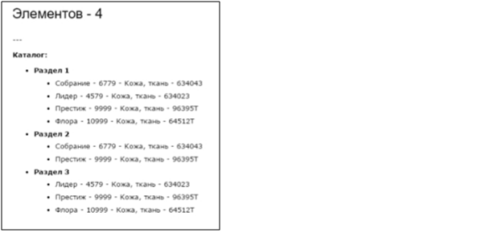

### [ех2-83] Добавить постраничную навигацию в созданный простой компонент

#### Решаемая задача

•	В созданном ранее компоненте добавить постраничную навигацию для элементов классификатора.

•	В контексте данного задания «элементами» классификатора - могут быть и разделы информационного блока и пользователи и другие сущности, а не только «элементы» информационного блока. Т.е. та сущность, по которой группируется вывод.

• В настройки компонента добавить параметр - количество элементов классификатора на странице.

#### Пример вывода (конкретные данные могут отличаться):

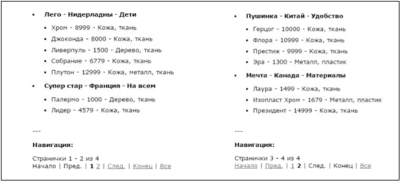

### [ех2-86] Проверка количества пользователей на сайте

•	Реализовать функционал: ежедневно подсчитывать количество пользователей зарегистрированных в системе и отсылать письмо-отчет.

•	Текст письма: «На сайте всего зарегистрировано [count] пользователей», где [count] -полученное количество.

•	Шаблон текста письма и адрес должен быть доступен для редактирования администратору сайта.

•	Функцию необходимо реализовать, используя технологию агентов, она должна запускаться 1 раз каждый день, в 01:00.

•	Почтовый сервер складывает письма в папку /home/bitrix/mail/, можно проверить решение.

•	Функцию назвать ExamCheckCount, агента - Подсчет пользователей сайта.

### [ех2-65] Создание комплексного компонента «Моя фотогалерея»

#### Общие требования

•	Расширить возможности стандартного комплексного компонента Фотогалерея (photo), добавить в него новую страницу exampage.php и переменные.

•	Для новой страницы exampage.php реализовать поддержку как ЧПУ так и не ЧПУ режима.

•	Для решения предоставляются материалы - заготовка компонента, complexcomp.exam- materials. Это компонент photo, с добавленными заглушками в параметрах, созданной страницей exampage.php. Необходимо реализовать логику в файле components и вывод в шаблоне по заданию.

•	Работу решения продемонстрировать в разделе сайта /ex2/complexcomponent/, добавить пункт в главное меню «Экзамен2», и пункт в левом меню «Комплексный компонент».

#### Доработка компонента

•	Добавить переменную для построения адреса страницы: PARAM1.

•	Шаблон адреса по умолчанию для страницы exampage.php при ЧПУ режиме: «123/456/edit/789/», где 123 это значение переменой SECTION_ID, 456 - ELEMENT_ID, 789 - PARAM1

•	Условие, по которому открывается страница exampage.php без ЧПУ режима: заданы значения переменных SECTION_ID, ELEMENT_ID, PARAM1

•	В настройках компонента реализовать

    о Для ЧПУ режима: управление шаблоном адреса страницы exampage.php о Для не ЧПУ режима: управление именами переменных.

#### Отображение данных

• Компонент настроить на отображение инфоблока Продукция. 

• На странице компонента detail.php, перед подключением bitrix:photo.detail вывести ссылку на страницу exampage.php. 

• Для проверки решения в ссылку подставить значениями переменных. SECTION_ID, ELEMENT_ID - значения определенные комплексным компонентом, PARAM1 = edit. 

• Значения можно подставить с помощью str_replace. 

• На странице exampage.php вывести значение переменных SECTION_ID, ELEMENT_ID, PARAM1, PARАМ2

### [ех2-74] Проверка текста при создании новости

•	Реализовать проверку при создании элемента информационного блока, в существующем информационном блоке Новости.

•	Если текст анонса содержит слово «калейдоскоп» то при создании новости - отменять создание

•	При отмене создания возвращать текст ошибки, с помощью соответствующей API. Текст: «Мы не используем слово калейдоскоп в анонсах новостей»

### [ех2-111] Оценить скорость работы созданного простого компонента.

•	Создать страницу /ex2/time_control/, добавить пункт в главное меню «Экзомен2», и пункт в левом меню «Оценка производительности».

•	С помощью специального инструмента Bitrix Framework определить параметры работы созданного простого компонента:

    o	При выключенном кеше: время работы компонента, количество запросов к базе данных.

    o	При включенном кеше: время работы компонента.

•	Полученные результаты записать на странице /ex2/time_соntrol/

